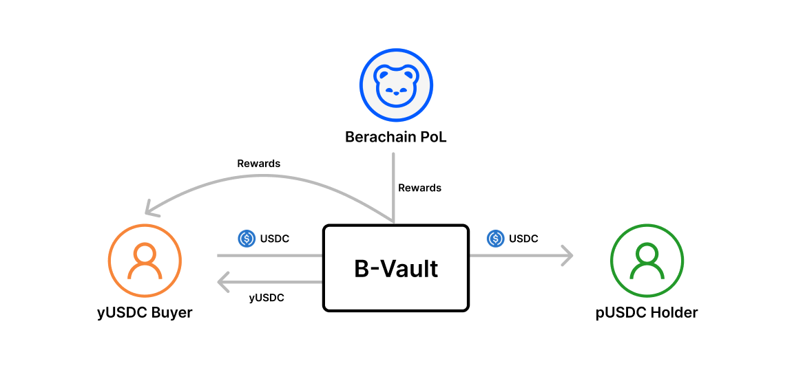

# Bribe Vault (B-Vault)

Under Berachain's Proof of Liquidity (PoL) mechanism, liquidity providers (LPs) are incentivized through emissions rewards. Zoo Finance's structured protocol leverages this PoL mechanism to create the Bribe Vault further enhancing the liquidity and capital efficiency within the Berachain ecosystem.

Bribe Vault (B-Vault) is a Pendle-like protocol. Users deposit assets and receive Principal Tokens (PT) and Yield Tokens (YT). Holding PT signifies ownership of the principal, while YT represents all real-time yields from the underlying assets. Unlike Pendle, It is perpetual, allowing users to hold PT or YT indefinitely without dealing with expiration.

The B-Vaults will be divided into epochs based on a fixed time cycle, with each subsequent epoch being generated only after the previous one ends. PT remains unchanged across different epochs. However, each epoch will have a uniquely numbered YT corresponding to that period.

Initially, we will set up  B-Vaults for incentive assets on Berachain. Let's use USDC as an incentive asset example to explain the working mechanism of the B-Vault.

<figure><figcaption></figcaption></figure>

When users deposit USDC into the B-Vault, they receive pUSDC at a 1:1 ratio. pUSDC is a rebasable token that provides interest earnings in USDC. At the same time, yUSDC is also generated at a 1:1 ratio and temporarily held in the contract. Users need to pay USDC to purchase a certain amount of yUSDC. The USDC used to purchase yUSDC serves as the interest source for pUSDC and is distributed to pUSDC holders. Additionally, the B-Vault earns rewards from Berachain's PoL mechanism, which are then distributed to yUSDC buyers.

<figure><figcaption></figcaption></figure>
