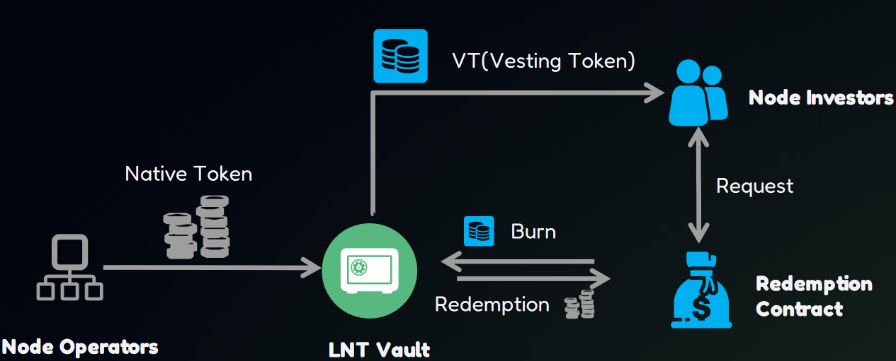

# VT Value Anchoring

The value of VT is anchored through the following three methods.

### Price formula

In the swap price formula for VT and T, **rateAnchor** plays a certain anchoring role. As time progresses, rateAnchor will gradually approach 1, meaning that the price of VT will slowly converge toward T.

### VT Put Option Mechanism:&#x20;

Although rateAnchor exists, the market may still experience price instability due to fluctuations in supply and demand dynamics. VT holders have the right to redeem VT for T via the protocol; this mechanism can increase VT price stability and reduce the gap between VT and T.

Node licenses held in the Vault will participate in the protocol's operations and earn Token rewards. Some protocols distribute rewards immediately, while others implement a delayed claim mechanism. Regardless of the approach, once the Vault receives the Token rewards, it will allocate these rewards to a redemption pool for VT. The operational mechanism is as follows:

* Users can deposit the VT into the redemption contract that they wish to redeem.
* Once the Vault receives the rewards, it will convert the users' VT to T automatically.
* If the amount of VT in the pool exceeds the rewards for the current period, participating users will receive settlement on a pro-rata basis. The remaining VT will continue to wait for the next batch of redemption until fully converted.

Note: The conversion ratio here is not 1:1 (including protocol service fee). Users can choose to accept it or wait until maturity for a 1:1 redemption(no service fee).

The workflow is as follows:

<figure><figcaption></figcaption></figure>

### Buyback via Swap


In addition to the above method, the Vault will also reserve a portion of tokens to conduct buybacks from the secondary market via swaps. This portion's timing and quantity will be determined based on market prices.

The workflow is as follows:

<figure><figcaption></figcaption></figure>

### Rigid redemption at the end

This is the ultimate guarantee of value anchoring: after the Vault operation ends, all circulating VT can be redeemed 1:1 for T.

